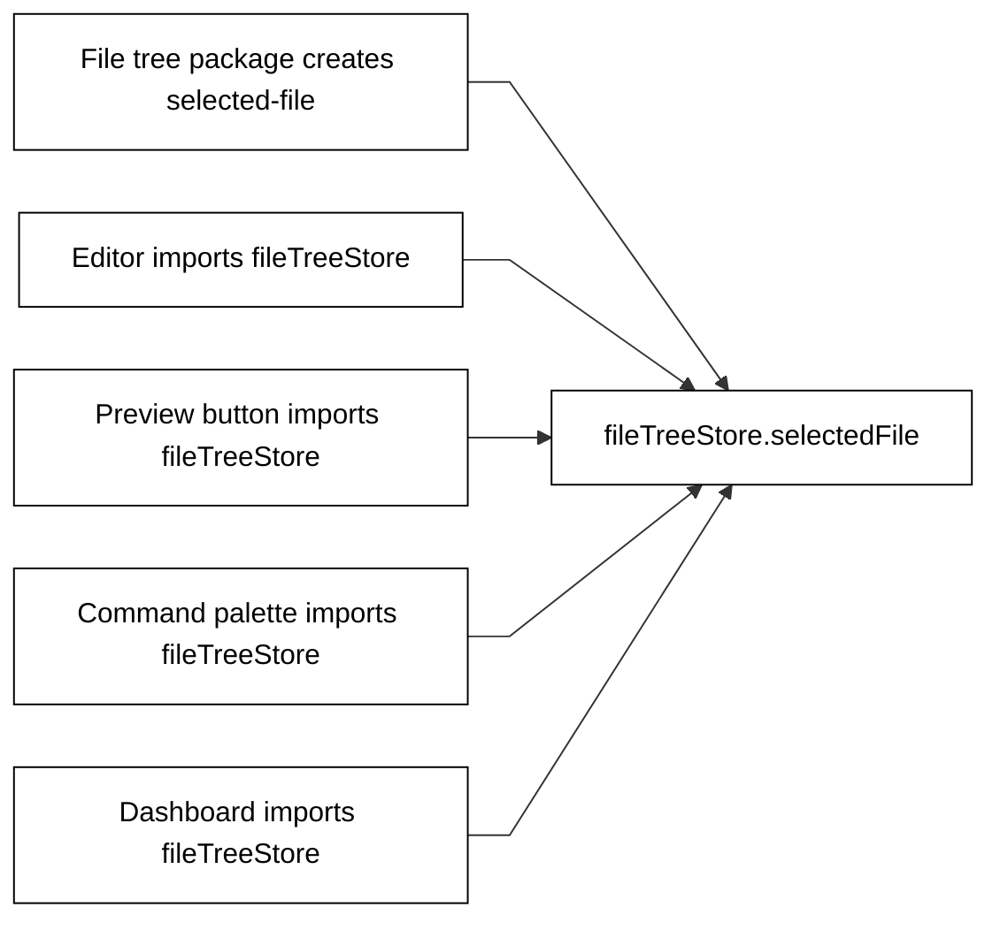
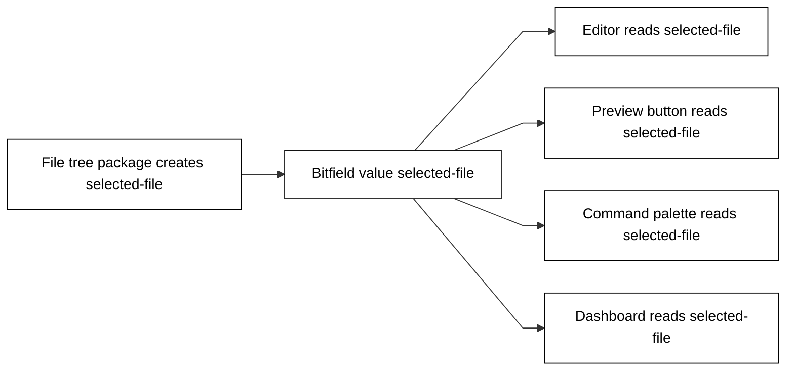

<div className="bf-article">

<p className="bf-lead">
Most app code starts from the old shape first. This page shows the exact translation: when code reaches for a store, service import, direct function call, package file, or shell branch, replace it with the Runtime Kit boundary that matches the job.
</p>

You are adding a file tree, editor, preview button, command palette action, sidebar item, or dashboard panel. The code works inside one app today, but it does it by teaching one package the private shape of another package. That is the moment to stop and translate.

By the end, you can point at each line of traditional code and say which Bitfield path replaces it: shared product fact, data name, action request, private UI state, or package file.

Traditional code lets one package become the private source every other package must know. The file tree owns the selected file, but the editor, preview button, command palette, and dashboard all point into the file tree's private store.



Bitfield code keeps the same producer and the same consumers, but none of the consumers depend on the file tree package. The file tree publishes the selected file into Bitfield, then every other package reads the public Bitfield value.



## Start with the job

Traditional app shape usually starts with the nearest import. Bitfield shape starts with the job the code is doing.

| The code is trying to... | Traditional mistake | Bitfield replacement |
|---|---|---|
| Let many packages know the same selected thing. | Put it in one feature store and import that store everywhere. | Put the selected thing in Bitfield state and read the named input. |
| Use data another package prepared. | Import the producer package or parse its files. | Read the data name. |
| Ask another package to run work. | Call the implementation function directly. | Send an action request. |
| Keep hover, debounce, menu, or draft timing. | Put visual timing in global product state. | Keep it as private UI state. |
| Let a shell show package-provided UI entries. | Hardcode every feature in the shell. | Read package records/descriptors and place what they say. |
| Ship help text, templates, or other package material. | Fetch another package's file from app code. | Let the package own the bytes and expose named data. |

React is one adapter for these reads and requests. A future native shell, command-line shell, game shell, or embedded device shell should use the same public names instead of learning another package's private code.

## What this prevents

Traditional app-code instinct makes the shortest path look correct: import the store, call the service, parse the file, add the shell branch, or move visual timing into a global object. That works until the next package needs the same thing from a different place.

Bitfield shape prevents that knot by making each package meet other packages through public names:

| Prevent this | Use this instead |
|---|---|
| Another package's private store becomes the shared source. | Bitfield state or a data name. |
| Another package's implementation function becomes the API. | An action request. |
| A package file path becomes the public names. | Package-owned bytes admitted through the package file. |
| A shell becomes a product-specific registry. | Published records/descriptors. |
| Visual timing becomes global product state. | Private UI state. |

## Example 1: selected text for the next assistant request

### Product job

A note editor lets the user highlight text. Another assistant request area should use that highlighted text. The editor also needs a small debounce so it does not publish every tiny mouse movement.

### Traditional mistake

The editor imports the assistant panel store and mutates it directly.

```ts
import { assistantRequestStore } from '../assistant-request/store';

export function onSelectionChanged(selection: EditorSelection) {
  assistantRequestStore.selectedText = {
    source: 'note',
    title: selection.title,
    text: selection.text,
  };
}
```

That couples the editor to the assistant panel. The editor now knows where the assistant panel keeps state, what the state object is called, and how the panel expects it to be shaped.

### Bitfield replacement

Keep the debounce timer private to the editor, then send the public request that updates the shared product fact.

```ts
import { sendRequestToBitfieldTarget } from '@bitfield/runtime-kit';

const UPDATE_SELECTED_TEXT_FOR_NEXT_ASSISTANT_REQUEST_ACTION =
  'action:update-selected-text-for-next-assistant-request';

export async function writeSelectedTextForNextAssistantRequest(value: {
  source: 'note';
  identifier: string;
  title: string;
  selectedText: string;
}) {
  await sendRequestToBitfieldTarget({
    target: 'slot::workflow',
    payload: {
      operation: 'execute_definition',
      definition_id: UPDATE_SELECTED_TEXT_FOR_NEXT_ASSISTANT_REQUEST_ACTION,
      include_steps: false,
      include_output: false,
      input: { value },
    },
  });
}
```

The private debounce still belongs in the editor UI. The selected text that another package needs goes through a public action request.

### Bitfield shape

```text
editor private state -> debounce timer
shared product fact -> selected text for next assistant request
work boundary -> action request
assistant request area -> reads the prepared/shared value
```

### Review check

No editor code imports the assistant-request package store.

## Example 2: sidebar entries without shell branches

### Product job

The sidebar needs to show product entries from many packages. Today it may show journal items, previews, dashboards, or support links. Tomorrow it may show package entries nobody has built yet.

### Traditional mistake

The sidebar imports every feature and grows one branch per product area.

```tsx
import { JournalNavItem } from '../journal/show/JournalNavItem';
import { ProjectPreviewNavItem } from '../project-preview/show/ProjectPreviewNavItem';
import { ComplianceNavItem } from '../roi/show/ComplianceNavItem';

export function AppSidebar({ currentArea }: { currentArea: string }) {
  return (
    <nav>
      {currentArea === 'journal' ? <JournalNavItem /> : null}
      {currentArea === 'preview' ? <ProjectPreviewNavItem /> : null}
      {currentArea === 'roi' ? <ComplianceNavItem /> : null}
    </nav>
  );
}
```

That makes the shell product-specific. Every new package now edits the shell, and the shell becomes the hidden central registry.

### Bitfield replacement

The sidebar reads published package records, finds the descriptors it knows how to place, and renders from those records.

```tsx
import { useBitfieldData } from '@bitfield/runtime-kit/react';

export function AppSidebar() {
  const publishedRecords = useBitfieldData('published-records');
  const records = readPublishedRecords(publishedRecords.data);
  const entries = findPlaceableSurfaces(records);

  return (
    <nav>
      {entries.map((entry) => (
        <SidebarItem
          key={entry.id}
          label={entry.label}
          target={entry.surfaceTarget}
        />
      ))}
    </nav>
  );
}
```

The shell knows how to place entries. It does not know the product story behind each package.

### Bitfield shape

```text
package publishes descriptor records
sidebar reads published-records
sidebar filters records it can place
sidebar renders label + target
package remains owner of its product meaning
```

### Review check

Adding a package entry should not require importing that package's React component into the sidebar.

## Example 3: preview work without importing the preview runner

### Product job

A button starts or refreshes a project preview. A status panel then reads the preview state.

### Traditional mistake

The button imports the preview implementation and calls it.

```ts
import { startPreviewServer } from '../project-preview/private/start-preview-server';
import { previewStore } from '../project-preview/private/preview-store';

export async function onPreviewClick(projectId: string) {
  const status = await startPreviewServer(projectId);
  previewStore.status = status;
}
```

That makes the button responsible for preview implementation details. It knows the private runner, private store, and return shape.

### Bitfield replacement

The button asks the public action to do the work. The status panel reads the prepared preview data.

```ts
import { sendRequestToBitfieldTarget } from '@bitfield/runtime-kit';

export async function startProjectPreview(projectId: string) {
  await sendRequestToBitfieldTarget({
    target: 'slot::workflow',
    payload: {
      operation: 'execute_definition',
      definition_id: 'action:start-project-preview',
      include_steps: false,
      include_output: false,
      input: { projectId },
    },
  });
}
```

```tsx
import { useBitfieldData } from '@bitfield/runtime-kit/react';

export function ProjectPreviewStatus() {
  const preview = useBitfieldData('project-preview-status');
  return <PreviewBadge state={preview.data?.state ?? 'unknown'} />;
}
```

### Bitfield shape

```text
button -> action request
preview owner -> runs preview work
status panel -> data name
button does not parse preview storage
status panel does not call preview runner
```

### Review check

Read paths and work paths stay separate. Requesting work is not the same as reading prepared state.

## Example 4: dashboard data without raw storage reads

### Product job

A compliance or health dashboard shows a prepared view of project facts. The dashboard should render the view and offer actions. It should not become a database client for another package's private storage shape.

### Traditional mistake

The dashboard imports low-level readers and assembles the other package's model itself.

```ts
import { readProjectFiles } from '../project/private/files';
import { readComplianceRows } from '../roi/private/rows';

export async function loadComplianceDashboard(projectId: string) {
  const files = await readProjectFiles(projectId);
  const rows = await readComplianceRows(projectId);
  return buildDashboardView(files, rows);
}
```

That leaks storage shape into the consumer. The dashboard has to know where project files live, how compliance rows are shaped, and how those rows become a screen.

### Bitfield replacement

The dashboard reads the named data that the owner exposes.

```tsx
import { useBitfieldData } from '@bitfield/runtime-kit/react';

export function ComplianceDashboard() {
  const compliance = useBitfieldData('project-compliance');

  if (compliance.status === 'loading') return <LoadingState />;
  if (compliance.status === 'error') return <ErrorState error={compliance.error} />;

  const feed = decodeProjectComplianceFeed(compliance.data);
  return <ComplianceList items={feed.items} />;
}
```

The dashboard still owns its render states. It does not own the producer package's storage shape.

### Bitfield shape

```text
producer package -> prepares project-compliance
dashboard -> reads project-compliance
dashboard -> renders loading, error, empty, success
dashboard actions -> action requests when work is needed
```

### Review check

If the dashboard needs to know how another package stores rows, the boundary is wrong.

## Example 5: package-owned help content

### Product job

A package ships help text or starter content that another area can display.

### Traditional mistake

Consumer code reaches into the package's file path.

```ts
const markdown = await fetch('/packages/getting-started/help/start-here.md')
  .then((response) => response.text());
```

That turns a file path into a public API. Moving the package file breaks the consumer.

### Bitfield replacement

The package owns the bytes. The consumer reads prepared content or a package-owned record.

```tsx
const help = useBitfieldData('getting-started-help');
```

### Bitfield shape

```text
package file -> declares package-owned bytes
Runtime Kit -> admits package material
consumer -> reads prepared help data
consumer -> never depends on the package file path
```

### Review check

A package file path is not a public product contract.

## Larger chain

### Traditional app-code instinct

One handler coordinates everything.

```ts
import { fileTreeStore } from '../file-tree/store';
import { editorStore } from '../editor/store';
import { startPreviewServer } from '../project-preview/private/start-preview-server';
import { assistantRequestStore } from '../assistant-request/store';
import { notificationStore } from '../notifications/store';

export async function onFileSelected(file: FileRecord) {
  fileTreeStore.selectedFile = file.id;
  editorStore.open(file);
  assistantRequestStore.context = { fileId: file.id, title: file.title };
  notificationStore.mode = 'quiet';
  await startPreviewServer(file.projectId);
}
```

### Bitfield shape

Each job goes through the boundary that matches it.

```text
selected file -> shared Bitfield state / data name
editor draft and cursor -> private UI state
assistant context from selection -> action request or data name
notification mode -> action request or shared product fact
preview start -> action request
preview status -> data name
sidebar entry -> published package descriptor
```

### Bitfield replacement

```ts
await sendRequestToBitfieldTarget({
  target: 'slot::workflow',
  payload: {
    operation: 'execute_definition',
    definition_id: 'action:update-selected-text-for-next-assistant-request',
    input: { value: selectedTextContext },
  },
});

await sendRequestToBitfieldTarget({
  target: 'slot::workflow',
  payload: {
    operation: 'execute_definition',
    definition_id: 'action:start-project-preview',
    input: { projectId },
  },
});
```

```tsx
const selectedFile = useBitfieldData('selected-file');
const previewStatus = useBitfieldData('project-preview-status');
const publishedRecords = useBitfieldData('published-records');

const [editorDraft, setEditorDraft] = useState('');
const [hoveredRow, setHoveredRow] = useState<string | null>(null);
```

The important difference is not that the code is longer or shorter. The important difference is that the editor, preview, sidebar, notifications, and assistant request area no longer import each other.

## Review checklist

| Question | Correct answer |
|---|---|
| Did a package import another package's store, service, component, private file, or implementation? | No. It used a data name, package descriptor, or action request. |
| Did a shell gain a branch for one product package? | No. It read records/descriptors and placed what it was given. |
| Did the UI store hover, cursor, debounce, or open-menu state in Bitfield? | No. Visual-only state stayed private. |
| Did the code call a runner directly because it was convenient? | No. It sent an action request. |
| Did a consumer parse another package's package file? | No. The package owned bytes and exposed named data. |
| Did React become the product architecture? | No. React is one adapter around reads, requests, and private UI state. |

## Translation prompt

```text
Translate the traditional code before editing.

For every import, state whether it is:
- public Runtime Kit adapter
- same-package helper
- another package private dependency

Reject another-package private dependencies.

For every state value, classify it:
- shared product fact
- data name
- action request
- private UI state
- package-owned bytes

Then write the Bitfield version using public reads, public action requests,
package records/descriptors, and private UI state only.
```

## Next

- See the shared-state version: [Share state between packages](/runtime-kit/build-without-tangled-code/share-state-between-packages)
- See the work-request version: [Ask another package to do work](/runtime-kit/build-without-tangled-code/ask-another-package-to-do-work)
- Review AI coding rules: [Rules for AI agents](/runtime-kit/build-without-tangled-code/rules-for-ai-agents)
- Check public calls: [Runtime Kit API](/reference/runtime-kit-api)

</div>
